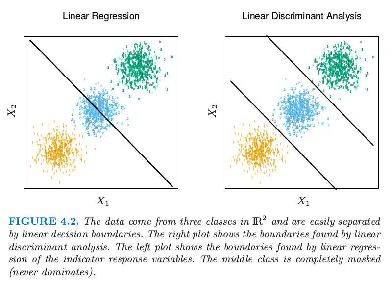
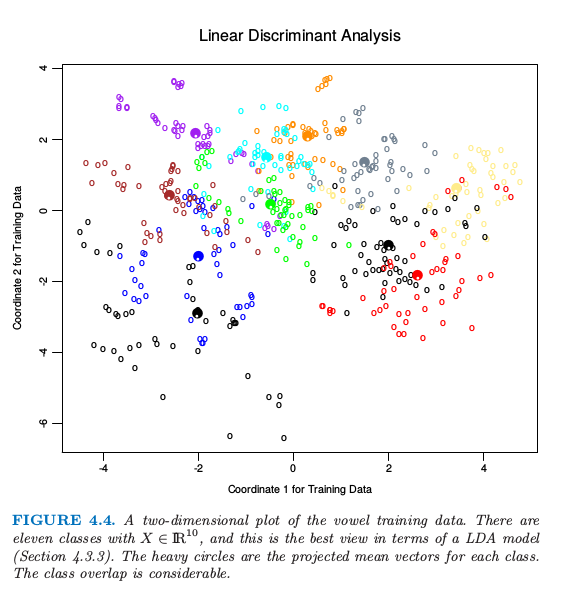

# 4.2 指示矩阵的线性回归

| 原文 | [The Elements of Statistical Learning](https://web.stanford.edu/~hastie/ElemStatLearn/printings/ESLII_print12.pdf#page=122) |
| :--: | :----------------------------------------------------------: |
| 翻译 |                          szcf-weiya                          |
| 时间 |                          2018-08-21                          |
| 注解 |                          Hytn Chen                           |
| 更新 |                          2020-02-22                          |

## 翻译原文

这里每个类别型响应变量用一个指示变量来编码．因此如果 $\cal G$ 有 $K$ 个类别，则会有 $K$ 个指示变量 $Y_k,\;k=1,\ldots,K$，若 $G=k,\;Y_k=1$，否则 $Y_k=0$．用向量 $Y=(Y_1,\ldots,Y_K)$ 来表示它们, 则这种形式的 $N$ 个训练实例组成了 $N\times K$ 的 **指示变量响应矩阵 (indicator response matrix)** $\mathbf Y$．$\mathbf Y$ 由 0 和 1 组成，每一行只含有一个 1．我们对 $\mathbf Y$ 的每一列同时用线性回归模型做拟合，拟合值由下式给出

$$
\mathbf{ \hat Y = {X(X^TX)^{-1}X^TY}} \tag{4.3}
$$

(Hytn注：就是[ESL3.2](https://blog.csdn.net/nstarLDS/article/details/104409997)节中的多重输出部分，按此进行处理，每一列都是一个输出结果)

第三章给出了线性回归的更多细节．注意到我们对于每个预测变量的列 $\mathbf y_k$ 都有一个系数向量，因此有一个 $(p+1)\times K$ 的系数矩阵 $\mathbf{\hat B=(X^TX)^{-1}X^TY}$．这里 $\mathbf X$ 是有 $p+1$ 列的模型矩阵，它对应 $p$ 个输入，以及一个截距项为 1 的列．

一个输入为 $x$ 的观测按下列步骤进行分类．

- 计算输出的拟合值 $\hat f(x)^T=(1,x^T)\mathbf{\hat B}$，这是一个 $K$ 维向量．
- 确定值最大的组分从而进行分类

$$
\hat G(x)=\mathrm{argmax}_{k\in\cal G}\hat f_k(x)\tag{4.4}
$$

这种方式的**理论根据**是什么？更加正式的理由是把回归看成条件期望的估计．对于随机变量 $Y_k$，$\rm{E}(Y_k\mid X=x)=\Pr(G=k\mid X=x)$，则每个随机变量 $Y_k$ 的条件期望似乎是一个明智的选择．真正问题是，除了刚性的 (rigid) 线性回归模型，条件期望的近似还可以达到什么程度？或者说，$\hat f_k(x)$ 是否是后验概率 $\Pr(G=k\mid X=x)$ 的合理估计，以及更重要地，这是否有用？

可以很直接地证明对于任意 $x$，只要模型中有截距（即 $\mathbf X$ 中元素为 1 的列），则有 $\sum_{k\in\cal G}\hat f_k(x)=1$．然而，$\hat f_k(x)$ 可以是负数或者比 1 大，而且事实上确实是这样．这是线性回归 **刚性本质 (rigid nature)** 的结果，特别是如果我们在训练数据之外做预测．这些违背常识的特点不能保证这个方法起作用，事实上在许多问题上它给出与标准的用于分类的线性方法类似的结果．如果我们允许在输入的基展开 $h(X)$ 上做线性回归，这个方法可以导出概率的一致估计．当训练集的规模 $N$ 变大时，我们自适应地加入更多的基元素使得在这些基函数的线性回归达到条件期望．我们将在[第 5 章](/05-Basis-Expansions-and-Regularization/5.1-Introduction/index.html)中讨论．

一个更简单的角度是对每个类别构造 **目标值 (target)** $t_k$，其中 $t_k$ 是 $K\times K$ 单位矩阵的第 $k$ 列．我们的预测问题是对一个观测尝试并且再生出合适的目标值．和之前的编码一样，对于第 $i$ 个观测的响应向量 $y_i$（$\mathbf Y$ 的第 $i$ 行），当 $g_i=k$ 时，$y_i=t_k$．我们可以通过最小二乘法来拟合线性模型

$$
\underset{\rm B}{\min}\sum\limits_{i=1}^N\Vert y_i-[(1,x_i^T)\mathbf B]^T\Vert^2\tag{4.5}
$$

这个准则是目标值到拟合向量的欧几里得距离的平方和．对于新观测值，通过计算它的拟合向量 $\hat f(x)$ 从而把它分到最近的目标：

$$
\hat G(x)=\underset{k}{\mathrm{argmin}}\Vert \hat f(x)-t_k\Vert^2\tag{4.6}
$$

(<u>Hytn注</u>：式4.5的感性理解就是，先看$\Sigma$里面，求的是每个标签向量也就是响应向量，和预测向量之间的欧几里得距离，再加上$\Sigma$就是所有距离之和，距离就代表了误差，所有误差最小也就自然是优化的目标了。而式4.6则表达的是，如何得知最终的分类结果呢？就是对于每个预测出的向量，自动寻找第k列也就是第k类，使得其与预测出向量$\hat f(x)$的欧几里得距离最小，这就叫最近目标分类准则)

这恰好与之前的方式相同：

- 平方和准则恰巧是**多重响应变量线性回归**的准则，仅仅是理解的角度不同．因为二范数自身也是一个平方和，其组成成分可以分解然后重排列成关于每个元素的单独的线性模型．注意到这仅仅是可能的，因为在模型中没有办法将不同的响应变量结合在一起．
- 可以很简单地发现最近目标分类准则 $\eqref{eq:4.6}$ 与 $\eqref{eq:4.4}$ 的最大拟合成分准则是一样的，但是需要要求拟合值的和为 1．

当类别的数目 $K\ge 3$ 时候回归方法有个很严重的问题，特别当 $K$ 很大时问题会很常见．由于回归模型的刚性性质，某个类别可以被其他的类别掩盖掉 (masked)．图 4.2 展示了 $K=3$ 时的一个极端情形．

> 图 4.2：这些数据来自 $\rm{IR}^2$ 的三个类别而且很简单地通过线性判别边界分开．右图显示了通过线性判别分析找到的边界．左图显示了通过对指示响应变量的线性回归找到的边界．中间的类别完全被掩盖掉了（不再是主要成分）．

这三个类别可以用线性判别边界完美地分离开，然而线性回归完全失去了中间这一类．

图 4.3 中我们将数据投影到连接三个形心的直线上（这种情况下在垂直方向上没有信息），图中已经包含这三类点并对这些响应变量进行编码 $Y_1,Y_2$ 和 $Y_3$．另外左图中加入三条回归直线，而且我们看到对应中间类别的直线是水平，它的拟合值永远都不显著！

> 图 4.3. $\rm{IR}$ 中对于含三个类别的问题的线性回归发生掩盖的影响．在坐标轴上的 rug plot 指示了每个观测值的位置以及类别关系．在每个面板上的三条曲线是根据三个类别的指示变量回归的拟合；举个例子，对于蓝色的类别，对于蓝色的观测值 $y_{blue}=1$，对于绿色和黄色的观测值为 0．**拟合分别是线性的和二次的**．每张图象的上方都是训练误差率．对于此问题，Bayes 误差率为 0.025，这也是 LDA 的误差率．

!!! note "weiya 注：rug plot"
    在 `R` 语言中 `rug` 是在坐标轴上标出元素出现的频数．出现一次，就会画一个小竖杠．从 `rug` 的疏密可以看出变量是什么地方出现的次数多，什么地方出现的次数少．

!!! note "weiya 注: 模拟 Fig. 4.2 & Fig. 4.3"
    已完成，参见[这篇笔记](../notes/LDA/sim-4-3/index.html)．

因此，类别 2 的观测值要么被分到类别 1 要么是类别 3．右图采用二次回归而不是线性回归．对于这个简单的例子二次拟合（至少对于中间的类别）会解决这个问题．然而，可以看到如果有四个像这样的类别（而不是三个）二次也不行了，便需要三次了．一个不严谨但是一般的规则是如果排列着 $K\ge 3$ 个类别，则可能需要 $K-1$ 阶多项式才能解决这个问题．同样注意到这些是通过形心派生的方向上的多项式，但是它们可以有任意的方向．所以在 $p$ 维输入空间中，一般需要 $K-1$ 阶、$O(p^{K-1})$项多项式和交叉积来解决这种极坏的情形．

这个例子是很极端的，但是对于大 $K$ 和小 $p$，这些掩盖会很自然地发生．作为一个更现实的图示，图 4.4 是元音识别问题中将训练数据投射到含有有用信息的二维子空间上．在 $p=10$ 维空间中有 $K=11$ 个类别．这是一个很复杂的分类问题，并且最好的方法在测试集上达到 40% 的误差．主要信息在表 4.1 中有总结；线性回归误差率为 67%，而与其很相关的线性判别分析误差率为 56%．在这种情形下掩盖现象进行了破坏．而本章中所有其他方法也都是基于关于 $x$ 的线性函数，它们以这种方式使用来避免掩盖问题．

> 图4.4. 元音训练数据的二维图．这里有 11 个类别，$X\in \rm{IR}^{10}$，这是关于一个 LDA 模型最好的观察（4.3.3节）．颜色深的圆圈是每个类的投影均值向量，这些类的重叠度是很高的．

> 表4.1. 在元音数据上运用一系列不同的线性方法得到的训练和测试误差率．在 10 维空间内有 11 个类，其中 3 个维度可以解释 90% 的方差（通过主成分分析）．我们看到线性回归被掩盖破坏了，测试误差比训练误差提高了 10%．
